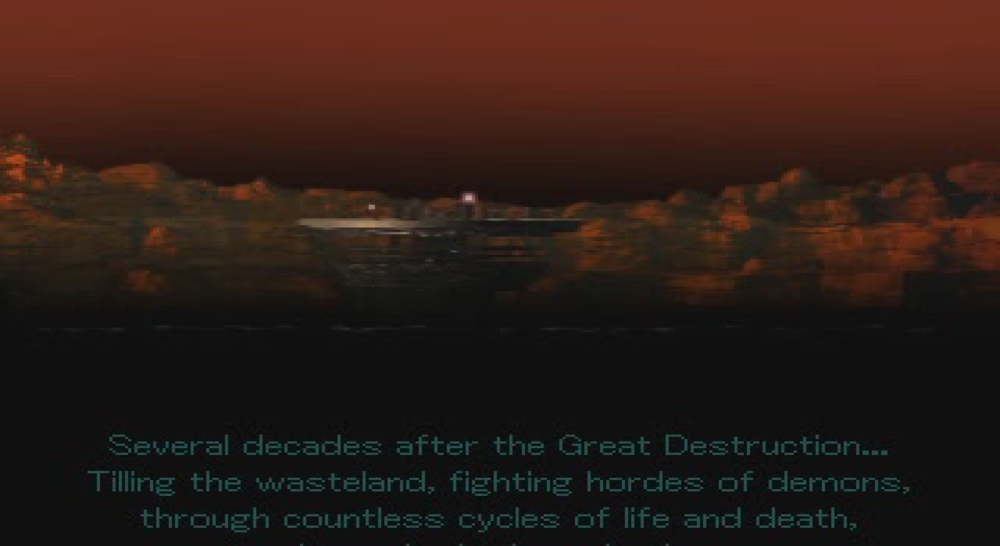
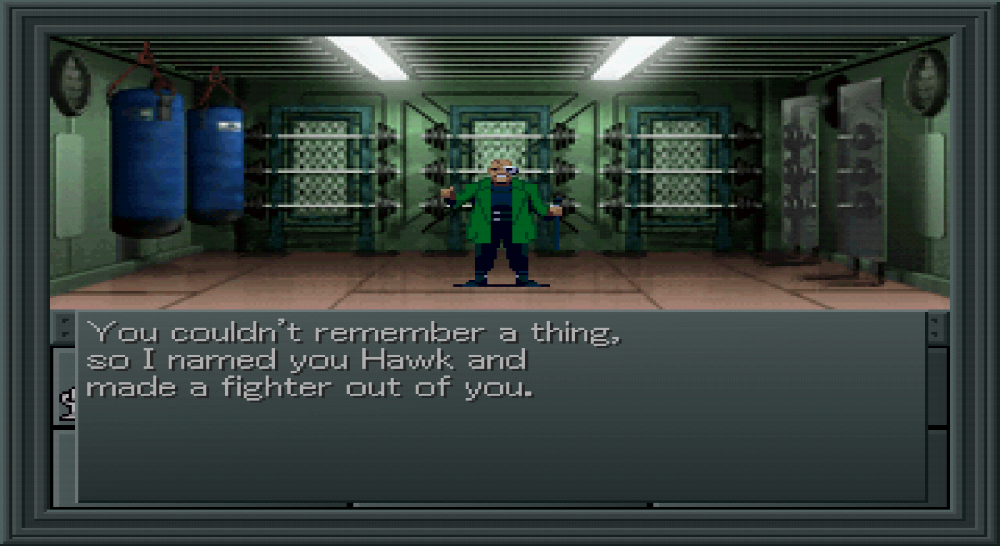
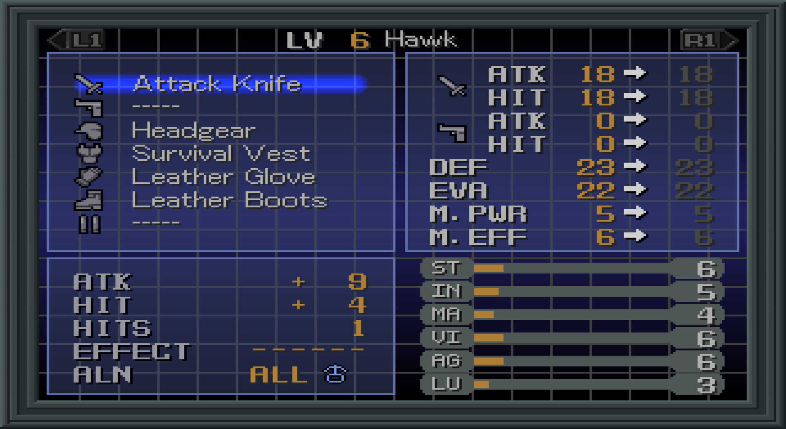

# Shin Megami Tensei II (PSX) English Translation

Work-in-progress fan translation tools for the PlayStation release of *Shin
Megami Tensei II*. This repository contains only the translation source and
build tooling. It does not contain, distribute, or download game data.

## Screenshots

<p align="center">
  <a href="screenshots/Intro.png"></a>
  <a href="screenshots/1.png"></a>
  <a href="screenshots/2.png"></a>
</p>

## Requirements

- Python 3.10 or newer
- [`pyxdelta`](https://pypi.org/project/pyxdelta/)
- [FFmpeg](https://ffmpeg.org/download.html) available on `PATH`
- [`psxavenc` 0.3.1](https://github.com/WonderfulToolchain/psxavenc/releases/tag/v0.3.1)
  available on `PATH`, placed at `build/psxavenc/bin/psxavenc.exe`, or supplied
  with `--psxavenc PATH`
- A legally obtained, verified **Shin Megami Tensei II (Japan) (Rev 1)**
  MODE2/2352 BIN image (222,694,416 bytes)

Install the Python dependency once:

```powershell
python -m pip install pyxdelta
```

## Build

1. Place the supported BIN image in the repository root. Its CUE file may sit
   alongside it for emulator use, but the build uses the BIN directly.
2. Run:

   ```powershell
   python build.py
   ```

   The build automatically mines its dialogue compression dictionary from the
   current translation corpus. The generated entries remain in memory and do
   not create or modify translation-source files.

   The usual Redump-style filename, `Shin Megami Tensei II (Japan) (Rev 1).bin`,
   is detected automatically. If the file has another name, it will still be
   used when it is the only root-level `.bin`; otherwise specify it explicitly:

   ```powershell
   python build.py --input "my-smt2-rev1.bin"
   ```

3. The build writes these generated files, which are intentionally ignored by
   Git:

   - `build/SMT2_EN.bin` — rebuilt game image
   - `build/SMT2_EN.xdelta` — patch from the supplied source BIN

   The build also writes `build/OPENING_EN.str`, the generated fixed-size
   English opening payload. It decodes the movie from the supplied disc,
   replaces the baked-in Japanese crawl using the game's own font, and
   re-encodes it at the original 320x240, 15 fps, 10-sectors-per-frame layout.
   Pass `--skip-opening` only for development builds that should retain the
   Japanese movie.

Apply the xdelta patch to the same verified source image. The matching CUE can
then be copied or renamed to refer to the patched BIN.

## Project layout

- `build.py` — full reproducible build; extracts the needed executable and data
  files directly from the supplied BIN, patches them, fixes Mode 2 EDC/ECC, and
  creates the xdelta.
- `tools/translations.py` — dialogue translation source.
- `tools/name_tables.py`, `menu_table.py`, `sys_strings.py`, and `map_names.py`
  — English UI, terminology, and location data.
- `tools/block_rebuild.py`, `build_en_tree.py`, `build_prod_exe.py`, `cdecc.py`,
  and `rdlogo.py` — codec and binary-patching support used by the build.
- `tools/dump_full_script.py` — optional developer utility that dumps the
  source dialogue directly from a supplied BIN.
- `tools/opening_movie.py` rebuilds the fixed-layout opening STR with the
  translated crawl.

## Developer utility

To regenerate a Japanese source-script reference without extracting the disc:

```powershell
python tools/dump_full_script.py --input "Shin Megami Tensei II (Japan) (Rev 1).bin"
```

It writes `SMT2_full_script.txt` containing the raw Japanese script.

## Legal

Use only a game image created from media you own, where permitted by applicable
law. Do not commit game binaries, CUE sheets, extracted disc files, or save
states to the repository. Release xdelta patches separately if you choose to
publish them. The build scripts target the Japan Rev 1 image only; other
revisions are not supported.
